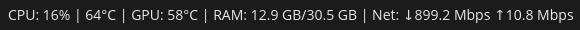

# System Stats Applet for COSMIC Desktop

A lightweight system monitoring applet for the COSMIC desktop environment.



## Features

- CPU usage monitoring
- Memory usage display
- Network upload/download speeds
- CPU temperature
- GPU temperature

## Dependencies

Building requires `just` and `libxkbcommon-dev`

## Installation

### Build and Install

```bash
just build-release
sudo just install
```

### From Package

**.deb package:**
```bash
sudo dpkg -i cosmic-applet-systemstats_1.0.0-1_amd64.deb
```

**.flatpak package:**
```bash
flatpak install --user cosmic-applet-systemstats.flatpak
```

<!-- ### From Flathub
```bash
flatpak install flathub io.github.rylan_x.cosmic-applet-systemstats
```
-->

<!-- ### From COSMIC Store
Find "System Stats" in the COSMIC Store under COSMIC Applets.
-->

## Configuration

The applet can be configured via `~/.config/systemstats/config.toml`. A default configuration file is automatically created.

### Configuration Options

```toml
# Refresh interval in milliseconds (default: 1000 = 1 second)
refresh_interval_ms = 1000

[monitors]
# Toggle individual monitors on/off (default: all true)
cpu_usage = true
cpu_temperature = true
gpu_temperature = true
memory = true
network = true
```

After editing the config file, restart the applet/panel for changes to take effect.
